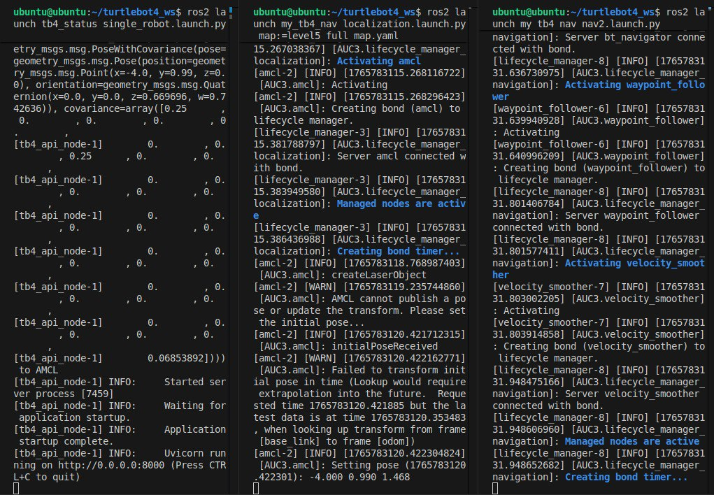

# Master Document for using Turtlebot4 with resource_management + webui

There are 4 packages that need to be "installed" in order to use the Turtlebot4's with `resource_management` and `webui`.
This has only been tested with ROS2 Humble and Ubuntu 22.04 LTS.

1. `tb4_status`: [Link to repository](https://github.com/bmanara/tb4_status)
    - Translates task instructions obtained from `tb_fleet_server` to Nav2 and AMCL instructions
    - Sends robot and task status to `tb_fleet_server`
2. `my_tb4_nav`: [Link to repository](https://github.com/bmanara/my_tb4_nav)
    - Responsible for launching Nav2 and AMCL lifecycles with custom config files
3. `tb_fleet_server`: [Link to repository](https://github.com/bmanara/tb_fleet_server)
    - Receive tasks from `fleet_server` and passes down to correct robot.
    - Sends robot and task status to `fleet_server` after receiving from robot
4. `tb4_status_interface`: [Link to repository](https://github.com/bmanara/tb4_status_interface)
    - Responsible for defining custom message, enabling communication between ROS2 nodes in `tb4_status`

## High Level Diagram


---

## Setup

Here are the steps to set up all 4 packages separately BEFORE running them concurrently.
_For more information on how each of the packages work, check out the README Developer Guide Sections for the respective packages_

### tb4_status

This should be setup in the Turtlebot4. _Highly recommend to go through [Turtlebot4 Official Tutorial](https://turtlebot.github.io/turtlebot4-user-manual/tutorials/driving.html)_

1. Create a new workspace (or in an existing one).

```bash
mkdir -p ~/turtlebot4_ws/src
cd ~/turtlebot4_ws/src
```

2. Go to the GitLab link and clone the repo.

```bash
git clone <link from GitLab>
```

3. Update the following in the files/code.
    - `MAP_FILE` variable in `tb4_status/tb4_api_node.py` needs to reference the .json file that has all the waypoints. Refer to `tb4_status` repo, under `examples/level5_full_map_updated.json` file for the format (exported from DB or I2R). _Note that I usually put the .json file in the workspace folder, since I run all programs here._
    - `namespace` variable in `launch/single_robot.launch.py` needs to be changed to the namespace your Turtlebot4 is using. (e.g AUC1)
    - `self.ip_address` and `self.uri` in `tb4_status/tb4_ws_node.py` needs to be updated to the turtlebot's IP address and the `tb_fleet_server` IP address (eg. if running in your local workstation, put your workstation's IP address)
    - `DEFAULT_INITLAL_POSE_POSITION` in `tb4_status/tb4_api_node.py` needs to be set to preferred initial pose position for robot. You can find this position from RViz.
    - Change `DEFAULT_INITIAL_POSE_ORIENTATION` in `tb4_status/tb4_api_node.py` to change rotation of final position. (not required)
    - Turtlebot4 needs to have .yaml and .pgm file and that isgenerated by Turtlebot4 mapping. These will be referenced when running localization (AMCL).

4. Build the package

```bash
cd ~/turtlebot4_ws
colcon build --cmake-args -DCMAKE_BUILD_TYPE=Release --packages-select tb4_status
```

Setup complete.

### my_tb4_nav

This should be setup in the Turtlebot4. _Highly recommend to go through [Turtlebot4 Official Tutorial](https://turtlebot.github.io/turtlebot4-user-manual/tutorials/driving.html)_

1. Create a new workspace (or in an existing one).

```bash
mkdir -p ~/turtlebot4_ws/src
cd ~/turtlebot4_ws/src
```

2. Go to the GitLab link and clone the repo.

```bash
git clone <link from GitLab>
```

3. Update the following in the files/code
    - Ensure that <map_name>.yaml can be referenced, it is used when running the program in bash. (Obtained from mapping with `slam_toolbox`, see `examples/level5_full_map.yaml` and `examples/level5_full_map_updated_v4.pgm` in the repo).
    - `namespace` in `launch/localization.launch.py` and `launch/nav2.launch.py` needs to be changed to the namespace your Turtlebot4 is using. (e.g AUC1)

4. Build the package

```bash
cd ~/turtlebot4_ws
colcon build --cmake-args -DCMAKE_BUILD_TYPE=Release --packages-select my_tb4_nav
```

Setup complete.

### tb_fleet_server

This should be setup in your local workstation.

1. Go to the GitLab link and clone the repo.

```bash
git clone <link from GitLab>
```

2. Update the following in the files/code
    - Update `IP_ADDRESS` dictionary mappings for namespace and IP addresses in both `server_ws.py` and `server_api.py` . These mappings should correspond to Turtlebot4 namespaces and their IP addresses.

Setup complete.

### tb4_status_interface

This should be setup in your Turtlebot4.

1. Create a new workspace (or traverse to an existing one).

```bash
mkdir -p ~/turtlebot4_ws/src
cd ~/turtlebot4_ws/src
```

2. Go to the GitLab link and clone the repo.

```bash
git clone <link from GitLab>
```

Setup complete.

---

## Launching the programs

Once setup is done, we can proceed to running all programs and checking if each of them are working together.
Do launch all programs in the order given below, it should work as expected, though might need to restart some if it fails to launch.

### For Turtlebot4

In all terminals, SOURCE YOUR TERMINAL

```bash
cd ~/turtlebot4_ws
source install/local_setup.bash
```

First terminal, launch `tb4_status` inside Turtlebot4.

```bash
ros2 launch tb4_status single_robot.launch.py
```

Second terminal, launch `my_tb4_nav` localization (AMCL) inside Turtlebot4.

```bash
ros2 launch my_tb4_nav nav2.launch.py
```

Third terminal, launch `my_tb4_nav` navigation stack (Nav2) inside Turtlebot4.

```bash
ros2 launch my_tb4_nav nav2.launch.py
```

### For local workstation

First terminal, run `tb_fleet_server` websocket server inside local workstation.

```bash
python3 server_ws.py
```

Second terminal, run `tb_fleet_server` api server inside local workstation.

```bash
python3 server_api.py
```

### Summary of Launch Sequence

All 5 programs should be up and running. If any fails, restart the launch sequence.

End state:
    1. Turtlebot4 will be localized and navigation stack up and running.
    2. Turtlebot4 updating `tb_fleet_server` about its status.
    3. Turtlebot4 able to receive tasks through `tb_fleet_server`.

__Turtlebot4 Terminals End State__


---

## Linking with `resource_management` and `webui`

Once all 5 programs are running, we can go ahead and run `resource_management`, `webui` and `fleet_server`.

Note that the `fleet_server` must be configured properly to talk to `tb_fleet_server`. Specifically, the API endpoints and Websocket endpoints should point to the correct IP address.

It has been tested with the following branches:

- `resource_management`: `feature/robot_docking` branch
- `webui`: `fix/swagger-ui_keycloak_integration` branch
- `fleet_server`: `turtlebot_integration` branch

_I cannot guarantee it works fully with the other branches, but there should be minimal fixes needed for the latest branches that work with AUC_

Do update the above list if there are any new branches that are configured to work with the Turtlebot4 platform.

---

## Common Issues

### Turtlebot4 Issues

1. Mapping/Navigation Issues
    - __Getting an error/warning telling you to stop mapping due to queue limits/buffer limits__
        - Error occurs due to CPU overload (I think)...
        - Solution: Map faster or use another Turtlebot that has less issues with CPU
    - __Getting an error/warning stating that controller frequency is not met (expected > actual)__
        - Error occurs due to CPU issues as well... (Frequency currently set to a low 5Hz)
        - Solution: Lower controller, planner frequencies even further (refrain if possible, else not responsive enough)
    - __Getting multiple LiDAR errors regarding timestamp__
        - Happens due to mismatch of datetime configuration between CPU and LiDAR
        - Solution: Connect to Create3 webpage for Turtlebot4 (http://<turtlebot_ip_address>:8000) -> Click on "Beta Features" -> "Restart ntpd" -> Wait for 30 seconds
    - __Turtlebot4 5 LED Lights not up after startup complete__
        - Solution: Power cycle Turtlebot4 (Wait for 3 minutes before powering on again)
    - __Turtlebot4 circling around waypoint endlessly__
        - Temporary Solution: Send pause and resume task through Postman (http://localhost:6000/auc/task)
        - Send task in this format {"auc_id": "AUC1", "task_type": "pause"}
        - Above is temporary, a more permanent fix would be to either improve navigation or create a more forgiving map
        - Permanent Solution: Provide more waypoints and routes with less angled turns / increase frequency of controller/costmap updates.

2. ROS2 Custom Packages Issues
    - __tb4_api_node, tb4_ws_node, Nav2 or AMCL failed to launch properly__
        - Ensure namespace defined properly
        - Launch the 3 launch files on the Turtlebot4 one by one, ensuring that each of them properly starts up before launching the others. Restart the launch if you have to.
    - __fleet_server not talking to tb_fleet_server__
        - Solution: fleet_server originally uses https for security reasons. Change to http to talk to tb_fleet_server.
    - __Turtlebot Navigation failed in the middle of trajectory__
        - Solution: Restart the trajectory by using _pause_ and _resume_ endpoints (either through Debugging in `webui` or Postman)

_Any other issues, do refer to Developer Guide to understand the codebase and underlying logic for the packages_
